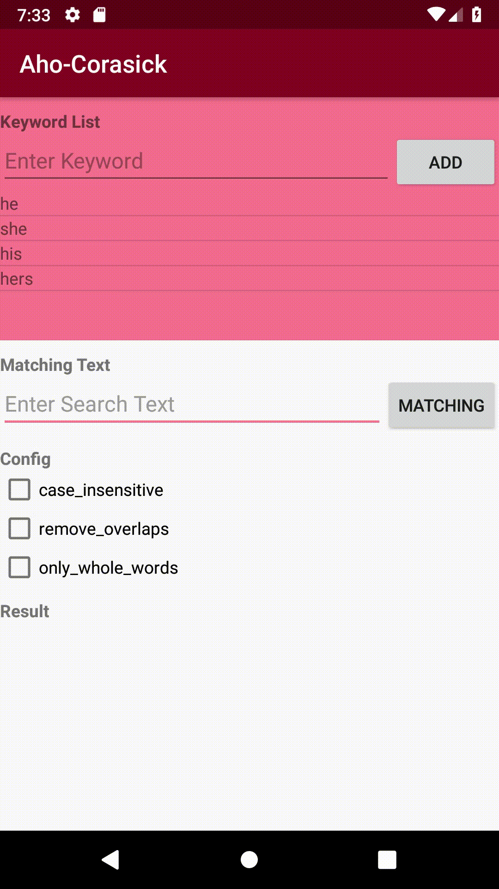
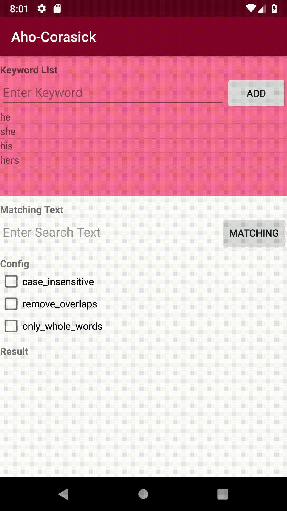

Android Aho-Corasick Sample
===================================

This sample is an example of string matching using the Aho-Corasick algorithm.

Introduction
------------

This sample is an Android Project of string matching using the Aho-Corasick algorithm.

Aho-Corasick algorithm is a very efficient dictionary matching algorithm that can locate all search patterns against in input text simultaneously in O(n + m), with space complexity O(m) (where n is the length of the input text, and m is the combined length of the search patterns).

This project uses native languages (JNI), assuming high computational complexity.
We used cjgdev/aho_corasick which implements the algorithm of Aho-Corasick by C++.

cjgdev/aho_corasick implements three configs, which also implement JNI functions.
- check CaseInsensitive ("casing"), "CaSiNg" =[0, 5] casing
- check RemoveOverlaps ("hot", "hot chocolate"), "hot chocolate" =[0, 12] hot chocolate
- check setOnlyWholeWords ("sugar"), "sugarcane sugar" =[10, 15] sugar

Please see the link below for a detailed explanation of the Aho-Corasick algorithm.

Screenshots
-------------

  

Reference
-------

- Efficient String Matching: An Aid to Bibliographic Search(Alfred V. Aho and Margaret J. Corasick Bell Laboratories): https://cr.yp.to/bib/1975/aho.pdf
- Aho-Corasick Implementation (C++): https://github.com/cjgdev/aho_corasick